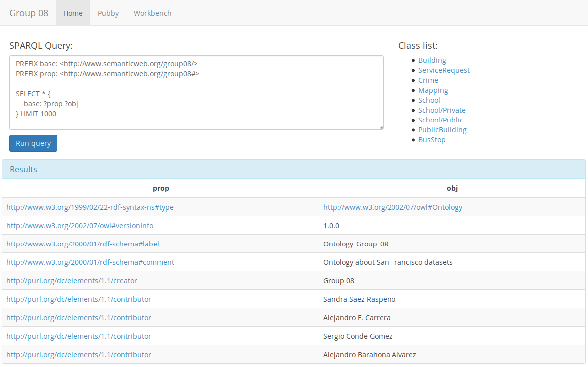

# Group 08 - Web Service

## Software used
 * [Sesame](http://rdf4j.org/)
 * [Pubby](http://wifo5-03.informatik.uni-mannheim.de/pubby/)
 * [Tomcat](http://tomcat.apache.org/) (for running Sesame & Pubby)
 * [Vagrant](https://www.vagrantup.com/) (creation and configuration of the VM)

## How to use
Just install [Vagrant](https://www.vagrantup.com/) and [Virtual Box](https://www.virtualbox.org/)
and then run `vagrant up` in this directory.

After a few minutes (if it's the first time you run this VM) you will have our sparql endopoint and
pubby running.

If you want to stop it just run `vagrant halt`, and if you want to destroy the VM just run `vagrant
destroy`

## Homepage
We've created a homepage where you can run your own querys and lists our classes. The results of the
query will be link you to its pubby instance.

If the resource is external the link will point to the resource itself.

The homepage is: http://localhost:8080/

## Other URIs
 * SPARQL endpoint: http://localhost:8080/openrdf-sesame/repositories/group08?query=
 * Pubby: http://localhost:8080/pubby/

## Problems found
### Problem importing some files in Virtuoso
At first we were using [Virtuoso](http://virtuoso.openlinksw.com/) but we found a problem importing
the TTL files with our data. The problem seems to be related to the importing of `POLYGON` in fields
with type `geosparql:wktLiteral` and the error message (in command line) was: `RDF box with a
geometry RDF type and a non-geometry content`.

We tried both `stable` and `devel` branchs of Virtuoso with no favorable results so we switched to
Sesame.

There is a fork of Virtuoso that seems to solve this issue that is discussed here:
https://github.com/openlink/virtuoso-opensource/issues/195
